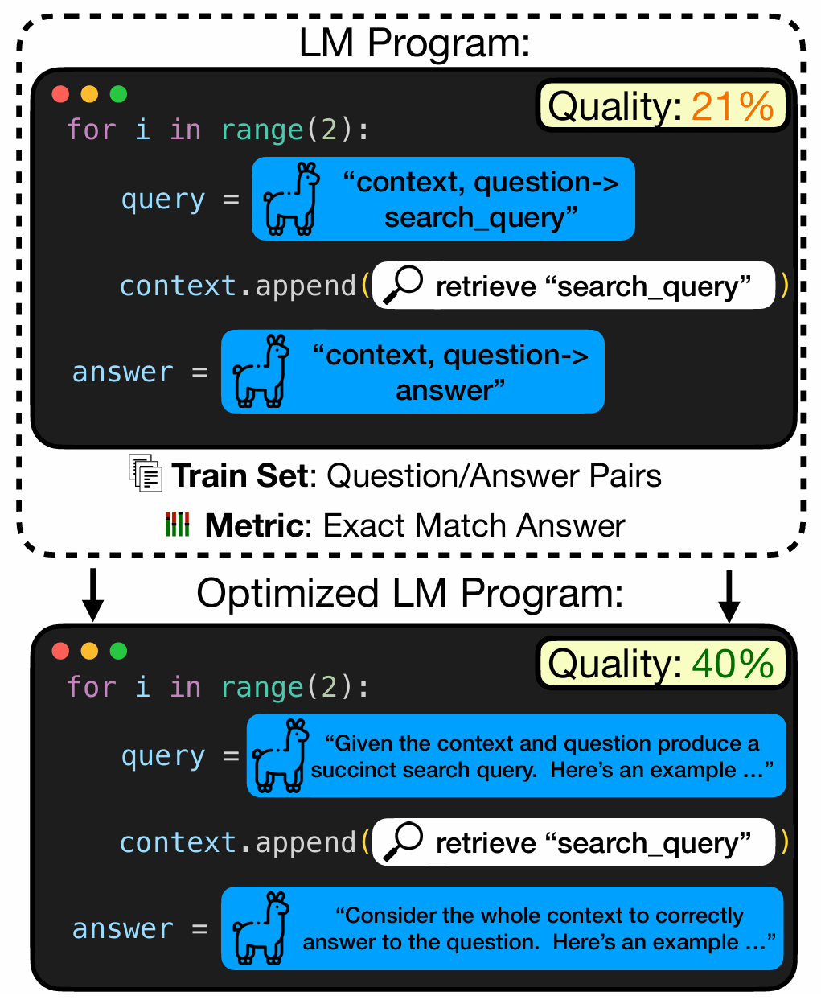
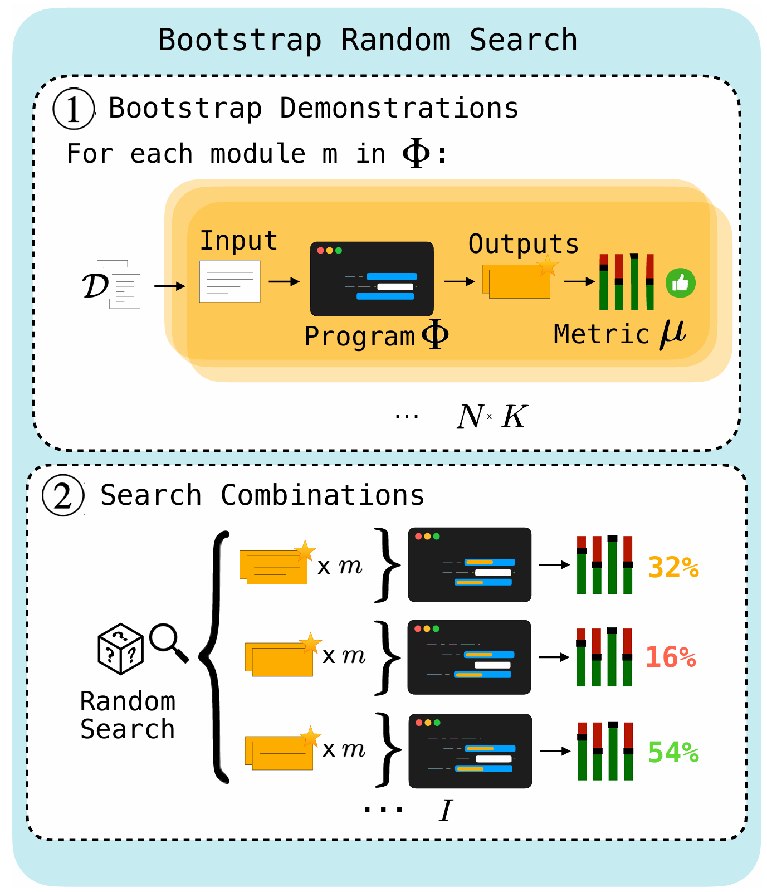
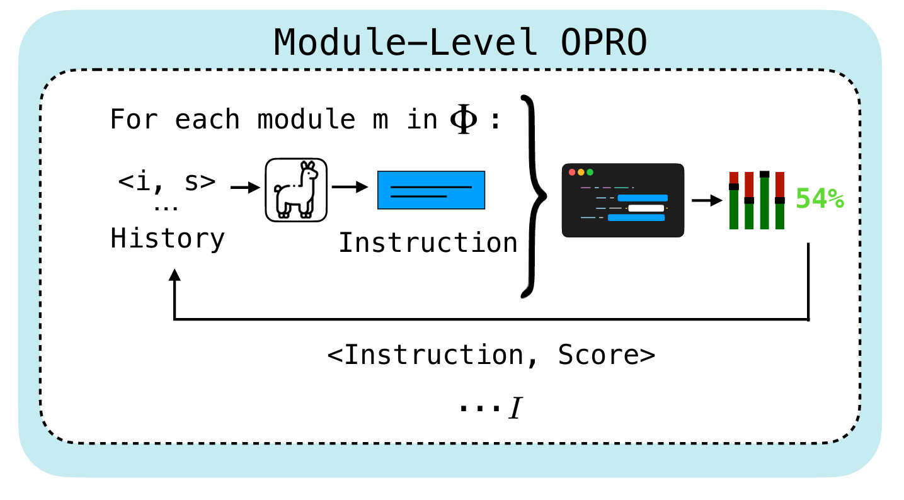
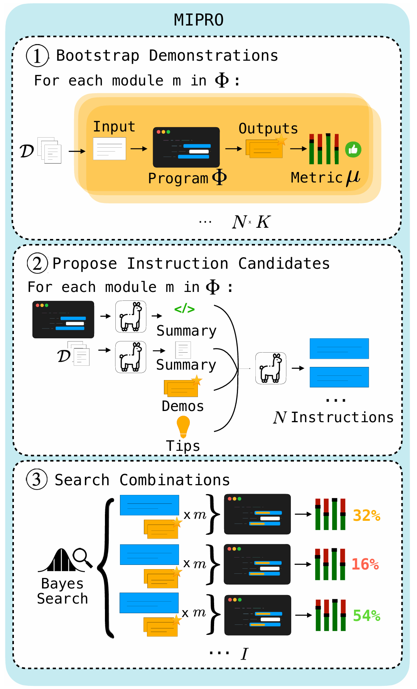

# [Self-Evolving-Agents](https://arxiv.org/pdf/2507.21046)

## [MIPRO](https://dspy.ai/) 
Optimizing Instructions and Demonstrations for Multi-Stage Language Model Programs. 
The authors seek to efficiently optimize prompts in arbitrary LM programs, especially those with multiple stages.

### **What is Language Model Program?**

A Language Model Program is software that separates Control Flow (Python code) from Model Parameters (Prompts & Demonstrations). 
It treats LLM calls as modular, trainable functions rather than static text strings.

#### 1. THE PROGRAM (Logic)
```
# defined by YOU. It is deterministic.
class RAG_Program(dspy.Module):
    def __init__(self):
        # "Layers": The specific LLM calls (optimizable parameters)
        self.search = dspy.ChainOfThought("question -> context")
        self.answer = dspy.Predict("context, question -> response")

    def forward(self, question):
        # "Control Flow": Loops, Logic, and Data Handling
        context = self.search(question)
        
        # You can add logic an LLM can't handle (e.g., hard limits)
        if len(context) > 1000:
            context = context[:1000]
            
        return self.answer(context=context, question=question)
```
#### 2. THE OPTIMIZER (MIPRO: Multi-prompt Instruction PRoposal Optimizer)
```
# The "Compiler" that tunes the prompts automatically.
# It treats instructions like weights in a neural network.
optimized_program = MIPRO(
    program=RAG_Program(),
    metric=grading_function
).compile()
```

**Key Difference**

Prompting: You edit the string "You are a helpful assistant..." manually.

LM Program: You write the code above, and MIPRO mathematically finds the best "You are a helpful assistant..." string for you.

### How can we optimize?
Maximize the downstream evaluation metric!

### Problem formalization

```
Algorithm 1 Optimize Φ with optimizer M
Input: Optimizer M, Initial Program Φ, Metric µ
Input: Max Iterations I, Training Data D
Input: Minibatch size B, Proposer Hyperparameters θ
Output: Optimized version of Φ

M.Initialize(D, θ) ▷ Initialize optimizer using the data
for k ← 1 to I do
    (V → S_k) ←M.Propose(θ) ▷Generate proposal (need to minimize)
    D_k ←{(x_j,x′_j) ∼ D}^B_j=1 ▷ Sample size-B batch
    σ ← 1/B Sum_{(x,x′)∈D_k} µ(Φ_{V→S_k}(x),x′) ▷ Validate updated program (need to minimize)
    M.Update(V → S_k, σ) ▷Update optimizer based on the observed validation score
end for
(V → S_k) ←M.ExtractOptimizedSets()
return Φ_{V→S}
```
Consider an LM program Φ consisting of m modules, each using some LM.
Each module i is defined by a prompt template p_i that contains a set of variables (open slots) v.
Let V be the set of all variables used by prompt templates for Φ, and let V → S be a total assignment of variables V to strings S.
Φ_{V→S} is the specified program.
The high-level goal is to find a total assignment V → S that optimizes Φ with respect to metric µ.

(i) each string s ∈ S can take on any value

(ii) the metric µ provides supervision only at the level of the entire task, so every variable in V is latent

(iii) assume no access to the gradients or embeddings of the LMs involved, which rules out many RL and prompttuning algorithms

(iv) system designers generally have small datasets D

(v) small budgets of LM calls for evaluating Φ

### Designing LM Program Optimizers



In Step 1, demonstrations are bootstrapped by running training inputs through the program Φ and keeping traces that produce sufficiently high scoring outputs, as judged by metric µ. 

In Step 2, these bootstrapped demonstration sets are searched over using random search, and the most performant set is returned.




